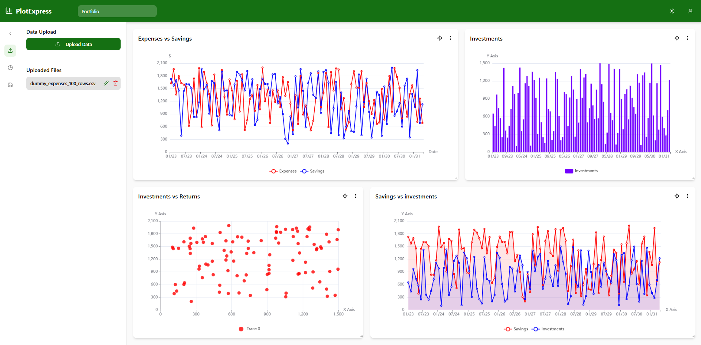

# PlotExpress

A lightweight, open-source data visualization playground for visualizing data from CSV, Excel, JSON, and other types of files.

## Key Features

- **Supports multiple data formats**: CSV, XLSX, JSON files.
- **Data Visualization**: Supports a rich set of chart types. More on the way!
- **Customizable Charts**: Modify chart properties with ease.
- **Data Persistence**: Uses IndexedDB for storing uploaded files.
- **Export Options**: Save charts as images or export them as documents with headings and descriptions.
- **Dark/Light Mode**: Accessible theme options.
- **Serverless Backend**: Utilizes Cloudflare Workers for lightweight backend operations.

## Tech Stack

- **Frontend**: React, Vite, TailwindCSS, ShadCN, TypeScript
- **Storage**: IndexedDB
- **Serverless Functions**: Cloudflare Workers

## Contributing

Contributions are welcome! Feel free to submit issues or pull requests.

## License

This project is licensed under the MIT License.
